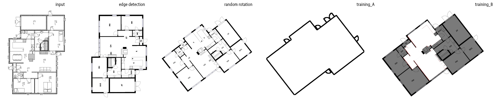

# Pix2PixHD_Image_Training_Tools

This repository contains utilities for preprocessing images for use with [Pix2PixHD](https://github.com/NVIDIA/pix2pixHD). The utilities use the CV2 and Pillow Python libraries for manipulating images. 

## Purpose of Utensils and Tools

The utensils were  developed to help edit the opensource [Cubicasa5k floorplan dataset](https://github.com/CubiCasa/CubiCasa5k). These tools are designed to enable users to edit images at scale, making it easy to modify large datasets of images quickly and efficiently for ML Training

## Requirements

The following versions of Python, CV2, and Pillow are required to use the utilities in this repository:

- Python 3.9 or higher
- OpenCV 4.5.4 or higher
- Pillow 8.3.2 or higher

Please note that this repository has been tested with Python 3.9, OpenCV 4.5.4, and Pillow 8.3.2. While it may work with other versions, we recommend using these specific versions to avoid any compatibility issues.

## Tools

The tools in this repository can be used to preprocess large image datasets for use with Pix2PixHD. The tools are designed to be used in batch mode, allowing you to process multiple images at once. 
